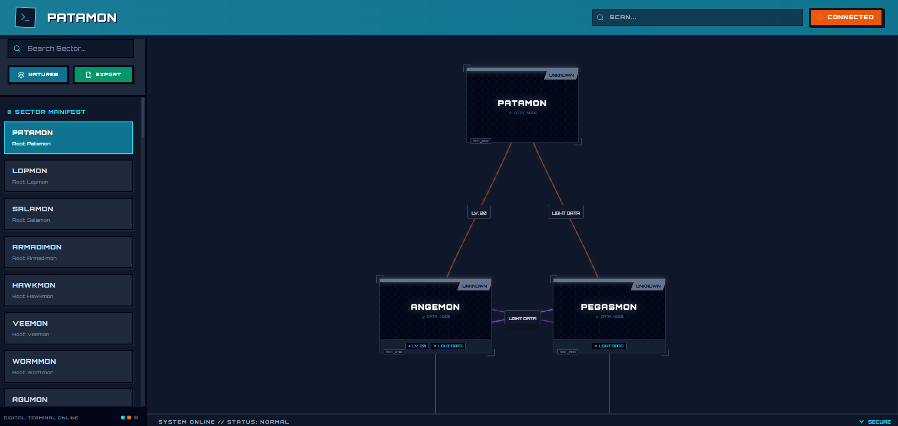
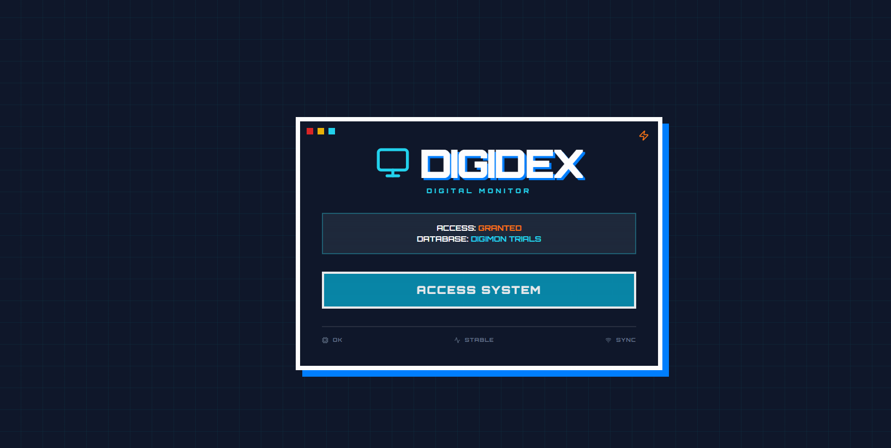
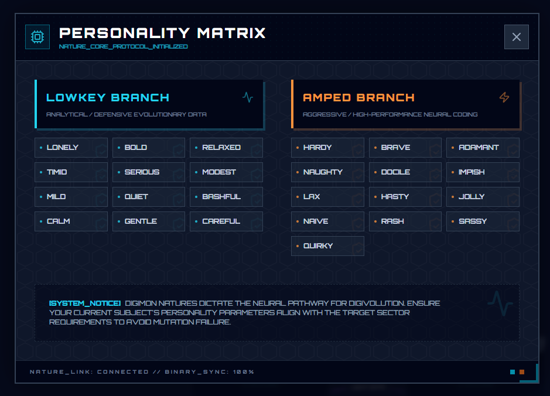
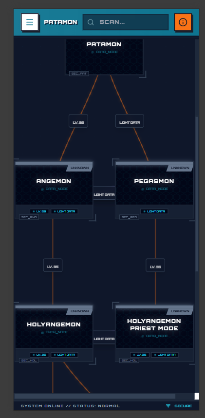
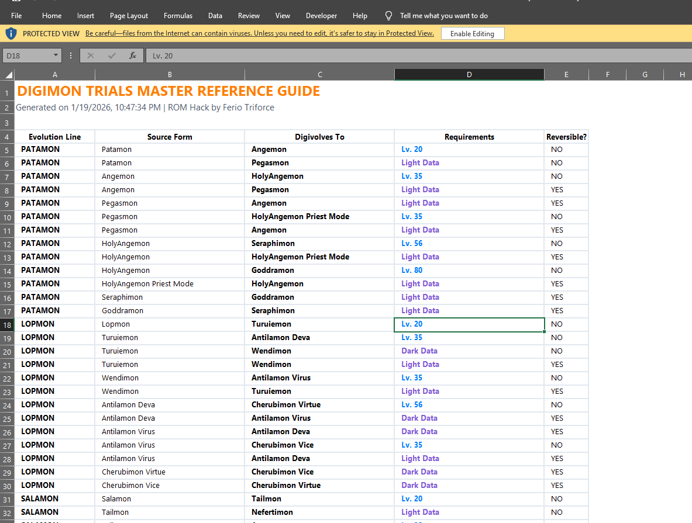
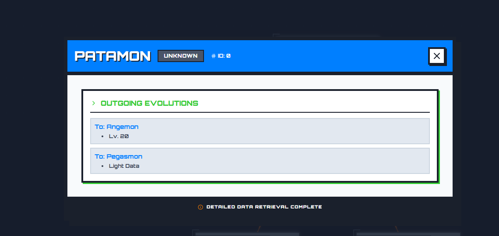

# Digimon Trials Dex

[](https://opensource.org/licenses/MIT)


A premium, interactive Digimon evolution guide and encyclopedia with a futuristic "Digital World" terminal aesthetic.

Developed specifically for the Pokémon GBA ROM hack **"Digimon Trials"** by **Ferio Triforce**.

<div align="center">
  
</div>

---

## Features

- **Evolution Trees**: Detailed visual paths showing how your Digimon can grow and evolve based on ROM hack data.
- **Predictive Search**: Smart "SCAN" system to quickly find any Digimon across multiple evolution lines.
- **Comprehensive Info**: Deep dives into stats, levels, and evolution requirements for every entry.
- **Nature System**: Integrated guide for Digimon natures and attributes tailored for Digimon Trials.
- **Futuristic UI**: A responsive, high-performance interface with digital particle effects and a terminal-inspired design.
- **Mobile Optimized**: Fully responsive sidebar and navigation for an on-the-go experience.

---

## Screenshots

<div align="center">
  <table>
    <tr>
      <td width="50%"></td>
      <td width="50%"></td>
    </tr>
    <tr>
      <td align="center"><b>Digital Dashboard</b></td>
      <td align="center"><b>Boot Sequence</b></td>
    </tr>
    <tr>
      <td width="50%"></td>
      <td width="50%"></td>
    </tr>
    <tr>
      <td align="center"><b>Nature Attributes</b></td>
      <td align="center"><b>Mobile Optimization</b></td>
    </tr>
    <tr>
      <td width="50%"></td>
      <td width="50%"></td>
    </tr>
    <tr>
      <td align="center"><b>Excel Export Function</b></td>
      <td align="center"><b>Detailed Card Data</b></td>
    </tr>
  </table>
</div>

---

## Technical Overview

- **Framework**: React 19
- **Build Tool**: Vite
- **Styling**: Tailwind CSS
- **Icons**: Lucide React
- **Language**: TypeScript

---

## Getting Started

### Prerequisites

- Node.js (Latest LTS recommended)

### Installation

1. **Clone the repository:**
   ```bash
   git clone https://github.com/bitancutiepie/DigimonTrialsDex.git
   cd DigimonTrialsDex
   ```

2. **Install dependencies:**
   ```bash
   npm install
   ```

3. **Start the development server:**
   ```bash
   npm run dev
   ```

4. **Build for production:**
   ```bash
   npm run build
   ```

---

## License

Distributed under the MIT License. See `LICENSE` for more information.

<div align="center">
  <i>Developed for Digimon tamers everywhere.</i>
</div>
