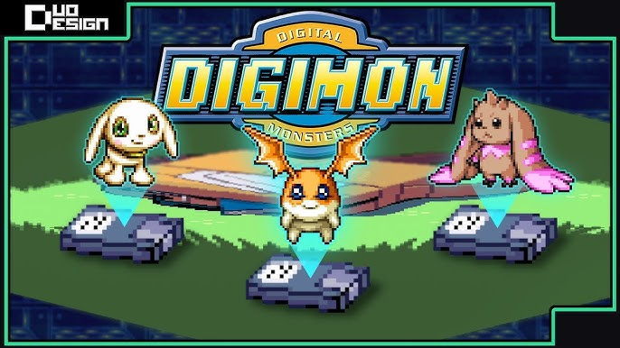

# Digimon Trials Dex 🐲

[](https://opensource.org/licenses/MIT)


A premium, interactive Digimon evolution guide and encyclopedia with a futuristic "Digital World" terminal aesthetic.

<div align="center">
  
</div>

---

## ✨ Features

- **Evolution Trees**: Detailed visual paths showing how your Digimon can grow and evolve.
- **Predictive Search**: Smart "SCAN" system to quickly find any Digimon across multiple evolution lines.
- **Comprehensive Info**: Deep dives into stats, levels, and evolution requirements for every entry.
- **Nature System**: Integrated guide for Digimon natures and attributes.
- **Futuristic UI**: A responsive, high-performance interface with digital particle effects and a terminal-inspired design.
- **Mobile Optimized**: Fully responsive sidebar and navigation for on-the-go Digivice experience.

---

## 📸 Screenshots

<div align="center">
  <table>
    <tr>
      <td width="33%"></td>
      <td width="33%"></td>
      <td width="33%"></td>
    </tr>
    <tr>
      <td align="center"><b>Digital Dashboard</b></td>
      <td align="center"><b>Evolution Paths</b></td>
      <td align="center"><b>Detailed Data</b></td>
    </tr>
  </table>
</div>

---

## 🛠️ Tech Stack

- **Framework**: [React 19](https://react.dev/)
- **Build Tool**: [Vite](https://vitejs.dev/)
- **Styling**: [Tailwind CSS](https://tailwindcss.com/)
- **Icons**: [Lucide React](https://lucide.dev/)
- **Language**: [TypeScript](https://www.typescriptlang.org/)

---

## 🚀 Getting Started

### Prerequisites

- [Node.js](https://nodejs.org/) (Latest LTS recommended)

### Installation

1. **Clone the repository:**
   ```bash
   git clone https://github.com/bitancutiepie/DigimonTrialsDex.git
   cd DigimonTrialsDex
   ```

2. **Install dependencies:**
   ```bash
   npm install
   ```

3. **Start the development server:**
   ```bash
   npm run dev
   ```

4. **Build for production:**
   ```bash
   npm run build
   ```

---

## 📁 Image Placeholder Guide

To complete the README, please add the following screenshots to the `images/` folder:

1.  **`banner.png`**: A high-resolution screenshot of the home screen or a custom wide graphic.
2.  **`preview1.png`**: The main dashboard showing the sidebar and current evolution line.
3.  **`preview2.png`**: A close-up of a complex evolution tree.
4.  **`preview3.png`**: The "Digimon Info" modal showing specific stats and requirements.

---

## 📄 License

Distributed under the MIT License. See `LICENSE` for more information.

<div align="center">
  <i>Developed for Digimon tamers everywhere.</i>
</div>
